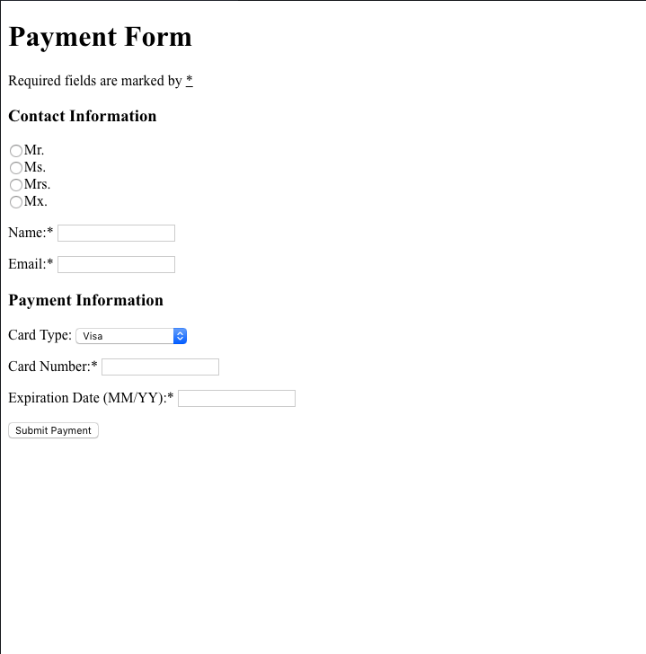

[](https://pursuit.org)

# HTML Introduction Lab

Let's get familiar with some of the more common and basic tages of HTML. 

___

## Getting Started 
* Fork this repo
* Clone the forked repository
* `cd` to the directory where you cloned it
* `npm install` to install dependencies
* `npm test` to run the tests

> *Note*: Remember to `git add`, `git commit` and `git push` regularly

## Submission Guidelines
  * When finished, commit and push your work.
  * Make a pull request on github.`
  * Submit the link to your pull request on Canvas. 


# Before you start

Since we're working in the web browser now, we're using a different testing framework called Cypress. Cypress runs your code in a virtual browser and can be programmed to examine various parts of your site.

Read [Testing Websites with Cypress](./cypress_intro.md) to get an understanding of how it works.

# Question One

[Source: Wikiversity](https://en.wikiversity.org/wiki/Web_Design/HTML_Challenges)

Create a file named `sundial.html`.

In the file you are going to copy and paste the Sundial text below into your html file.
```html
Sundial

From Wikipedia, the free encyclopedia.


A sundial measures time by the position of the sun. The most commonly seen designs, such as the
'ordinary' or standard garden sundial, cast a shadow on a flat surface marked with the hours of
the day. As the position of the sun changes, the time indicated by the shadow changes. However,
sundials can be designed for any surface where a fixed object casts a predictable shadow.

Most sundial designs indicate apparent solar time. Minor design variations can measure standard and daylight saving time, as well.

History

Sundials in the form of obelisks (3500 BC) and shadow clocks (1500 BC) are known from ancient
Egypt, and were developed further by other cultures, including the Chinese, Greek, and Roman
cultures. A type of sundial without gnomon is described in the old Old Testament
(Isaiah 38:2).

The mathematician and astronomer Theodosius of Bithynia (ca. 160 BC-ca. 100 BC) is said to have
invented a universal sundial that could be used anywhere on Earth. The French astronomer Oronce Fine constructed a sundial of ivory in 1524. The Italian astronomer Giovanni Padovani published a treatise on the sundial in 1570, in which he included instructions for the manufacture and laying out of mural (vertical) and horizontal sundials. Giuseppe Biancani's Construction instrumenti ad horologia solaria discusses how to make a perfect sundial, with accompanying illustrations.

Installation of standard sundials

Many ornamental sundials are designed to be used at 45 degrees north. By tilting such a sundial, it may be installed so that it will keep time. However, some mass-produced garden sundials are inaccurate because of poor design and cannot be corrected.
```

Now double click the file to open it in your browser and you'll see it doesn't look like the example image below. This is because you haven't added any HTML tags to your code, so the browser renders your text exactly as is.

[](https://en.wikiversity.org/wiki/File:Html_challenge1.png#/media/File:Html_challenge1.png)
*By Michael Nelson - screenshot on ubuntu linux, [CC BY-SA 2.5](http://creativecommons.org/licenses/by-sa/2.5 "Creative Commons Attribution 2.5")*

Your challenge will be to add HTML tags to make your file look like the one in the image:

* headings (`<h1>`, `<h2>`, `<h3>` etc.)
* paragraphs (`<p>`)
* emphasis and strong (`<em>` and `<strong>`)


A web browser will display the `h1` heading very large, and the `h6` heading quite small, and all the other headings in between! But don't get into the habit of selecting an h4 heading just because it's the size you want! You can always modify the size of your elements using your stylesheet (more on that later).

The key is to use the headings to structure your information in a useful (and meaningful) way! For example, every page should only ever have one main heading - your h1 heading. An h2 heading should only ever be a sub-heading of your h1 heading. Similarly, an h3 heading should only ever be a sub-heading of an h2 heading etc.

# Question Two

Make a file `recipe.html` that renders a recipe. It should look exactly to this:


Include the following:

1. A main heading. `<h1>`
2. A description. `<p>`
3. An unordered list of ingredients. `<ul>`
4. An ordered list of directions. `<ol>`
5. Add a link to a similar recipe somewhere online.

# Question Three

Make a file `paymentForm.html` that displays a form to enter payment information.  It should like similar to this:



# Additional Questions from [w3schools](https://www.w3schools.com/html)

- https://www.w3schools.com/html/exercise.asp?filename=exercise_html_attributes3
- https://www.w3schools.com/html/exercise.asp?filename=exercise_html_attributes4
- https://www.w3schools.com/html/exercise.asp?filename=exercise_html_headings1
- https://www.w3schools.com/html/exercise.asp?filename=exercise_html_headings3
- https://www.w3schools.com/html/exercise.asp?filename=exercise_html_headings4
- https://www.w3schools.com/html/exercise.asp?filename=exercise_html_paragraphs1
- https://www.w3schools.com/html/exercise.asp?filename=exercise_html_paragraphs2
- https://www.w3schools.com/html/exercise.asp?filename=exercise_html_paragraphs3
- https://www.w3schools.com/html/exercise.asp?filename=exercise_html_paragraphs4
- https://www.w3schools.com/html/exercise.asp?filename=exercise_html_formatting1
- https://www.w3schools.com/html/exercise.asp?filename=exercise_html_formatting2
- https://www.w3schools.com/html/exercise.asp?filename=exercise_html_links1
- https://www.w3schools.com/html/exercise.asp?filename=exercise_html_images5
- https://www.w3schools.com/html/exercise.asp?filename=exercise_html_lists1
- https://www.w3schools.com/html/exercise.asp?filename=exercise_html_lists2
- https://www.w3schools.com/html/exercise.asp?filename=exercise_html_forms1
- https://www.w3schools.com/html/exercise.asp?filename=exercise_html_forms2
- https://www.w3schools.com/html/exercise.asp?filename=exercise_html_form_elements1
- https://www.w3schools.com/html/exercise.asp?filename=exercise_html_form_elements2
- https://www.w3schools.com/html/exercise.asp?filename=exercise_html_form_input_types1
- https://www.w3schools.com/html/exercise.asp?filename=exercise_html_form_input_types2
- https://www.w3schools.com/html/exercise.asp?filename=exercise_html_form_input_types3
- https://www.w3schools.com/html/exercise.asp?filename=exercise_html_form_input_types4

# Bonus

Complete all HTML questions from w3schools, researching specific tags that we didn't cover in class.
