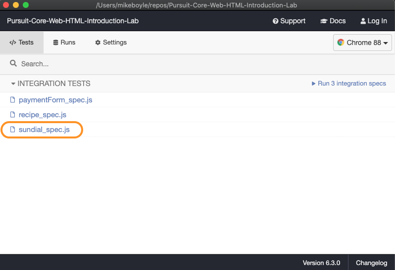
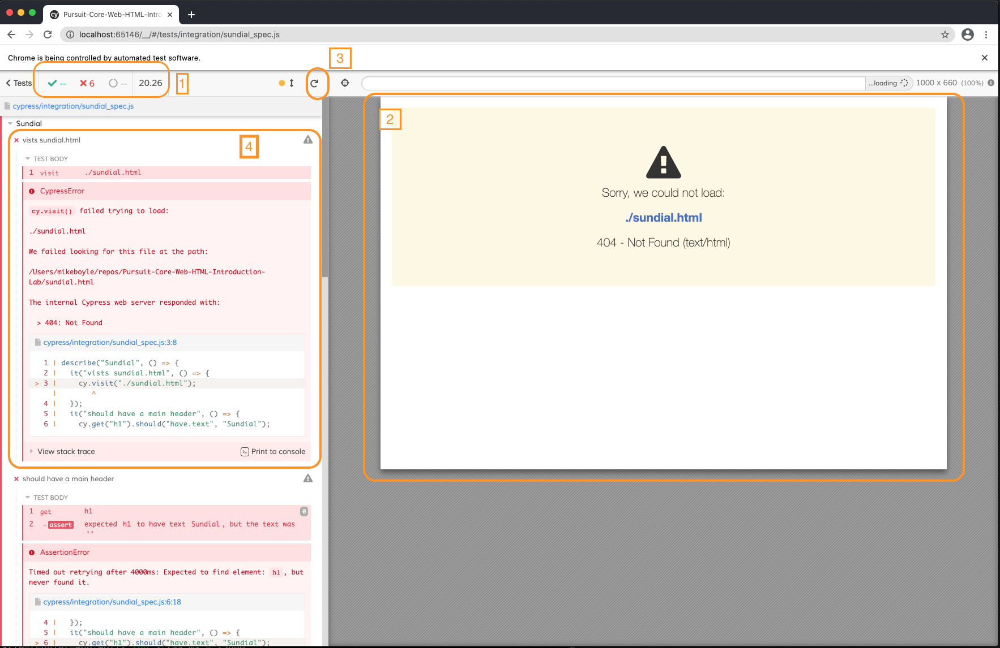
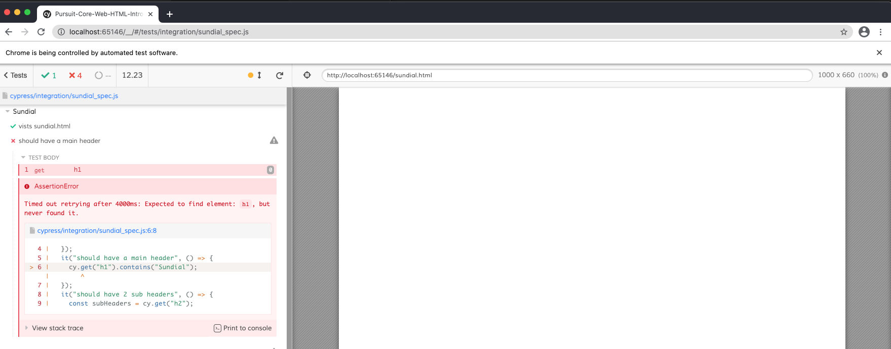
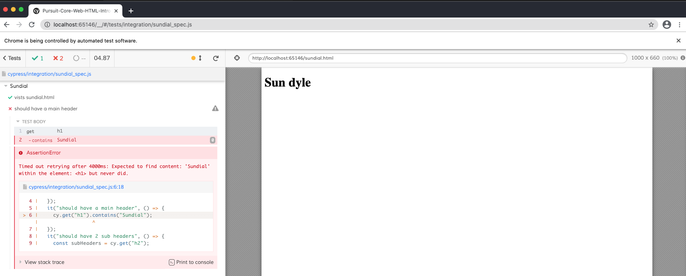
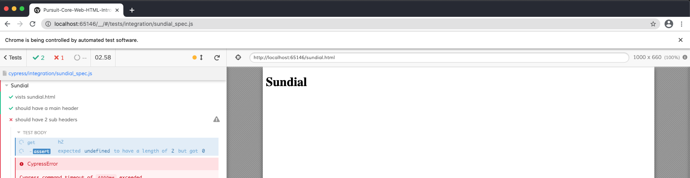

# Testing Web Sites with Cypress

## Review: testing JS functions
In labs and assessments, you've already seen automated testing that we use for the functions you write in plain JavaScript. Remember how those work:
1. You run the command `npm test` in your terminal.
1. The test calls your function with different inputs
1. The test compares the output of each function call to the "correct" output it expects to see.
1. If the expected and actual outputs match, the test passes!

Here's an example of that:
```js
// your function
function isOdd(n) {
  return n % 2 === 1;
}

// the test
describe('isOdd', () => {
  it('returns true for odd numbers', () => {
    expect(isOdd(47)).toBe(true);
  });

  it('returns false for even numbers', () => {
    expect(isOdd(888)).toBe(false);
  });
});
```
When you run `npm test` in your terminal, the test code does these things:
- call `isOdd(47)` and expect the result to be `true`
- call `isOdd(888)` and expect the result to be `false`

## Okay, so how do we test websites?
So we know how to write and test functions. But now we're going to do labs and assessments using websites built with HTML. 

**Websites aren't functions. So how do we test them?**

We test websites (or HTML files on your computer) using a different type of automated tool. Here's how this type of tool works:
1. You run the command `npm test` (same!)
1. The tool launches a web browser in your computer that is controlled by the tool.
1. Our test code gives the tool instructions for what to do in the browser. For example, we can tell the tool to:
- visit a URL (or open an HTML file on our computer)
- type into a form or text input
- click on a button, link, checkbox, dropdown menu, etc.
- check that certain text or elements appear on the page

If you've never seen one of these tools before, you'll be amazed. A web browser opens up on your computer and it's as though a ghost is using the browser to visit sites, submit forms, etc.

## Testing websites with Cypress
Website testing tools have been around for a long time. You will often see the names of these tools on Stack Overflow: `selenium`, `puppeteer`, `poltergeist`, `phantomJS`, `capybara`, `testcafe` are just a few. Almost all of them are terrible and frustrating.

The testing tool we will use in this class is [Cypress](https://www.cypress.io/), which is the best and most popular website testing tool in the industry. Yay!

Here's [the Cypress test for the first problem in the HTML intro lab](https://github.com/joinpursuit/Pursuit-Core-Web-HTML-Introduction-Lab/blob/master/cypress/integration/sundial_spec.js#L1-L16):

```js
describe("Sundial", () => {
  it("vists sundial.html", () => {
    cy.visit("./sundial.html");
  });
  it("should have a main header", () => {
    cy.get("h1").contains("Sundial");
  });
  it("should have 2 sub headers", () => {
    const subHeaders = cy.get("h2");
    subHeaders.should("have.length", 2);
  });
  // more tests...
});
```

Let's look at the first few tests and what they do.

1. Visit the web page
- We use the function `cy.visit()` to visit a URL or open an HTML file.
- `cy.visit` takes a URL or file path as its argument: `cy.visit("./sundial.html")`
- If cypress cannot visit the page or open the file, the test fails.

2. Find the main header and test that it has the text `Sundial`
- We use the function `cy.get()` to find an element on the page
- `cy.get("h1")` returns a list of all of the `<h1>` elements on the page. 
- If there is no `<h1>` element, the test fails.
- If Cypress finds any `<h1>` elements, we use the `contains()` function to find the first `<h1>` that contains the text we're looking for.
- `get()` and `contains()` are combined with chaining: `cy.get("h1").contains("Sundial")`
- If the are not any `<h1>` elements that have the text `Sundial`, the test fails.

3. Check that there are two subheaders
- We use `cy.get("h2")` to find all of the `<h2>` elements.
- The list of `<h2>` elements is assigned to the `subHeaders` variable.
- We use `should("have.length", 2)` to check that the list of `<h2>` elements has a length of two. (That is, we check that there are two `<h2>` elements, not 1, not 3, not 4...)
- If there are not exactly 2 `<h2>` elements, the test fails.


So far we've seen a few important Cypress functions:
- `cy.visit()`: visit a page or open an HTML file
- `cy.get()`: find an element on the page
- `cy.get().contains()`: find an element that contains certain text
- `cy.get().should()`: find an element and check that it does something.

You will see in other tests that there are many things we can check using `cy.get().should()`. For example:
```
// Find an input element and check that it has type='text' attribute
cy.get("input").should("have.attr", "type", "text");

// Find a select element and check that the selected value is "Visa"
cy.get("select").should("have.value","visa")
```

You wil see other important Cypress commands in tests that interact with elements on the page:
```
cy.get('button').click(); // Find the button and click it
cy.get('input').type('Hello, World') // Type 'Hello, World' into the 'input'
cy.get("select").select("visa"); // Find the select dropdown and choose the "visa" option
```
Check out [the Cypress documentation](https://docs.cypress.io/api/api/table-of-contents.html) for more details about these commands.

## Running, debugging, and rerunning your first Cypress test
When you run Cypress tests, there will be activity in a few different places, so be prepared to manage a few different windows on your computer:
- your terminal (where you type `npm install` and `npm test`)
- the Cypress desktop application (which the `npm test` command opens)
- a separate Chrome browser controlled by Cypress (which is opened by the Cypress desktop application when you run a test).

Let's run the cypress tests for [the "Sundial" problem in the HTML intro lab](https://github.com/joinpursuit/Pursuit-Core-Web-HTML-Introduction-Lab#question-one):
1. In your terminal, run `npm install`
2. In your terminal, run `npm test`
3. You will see a message in your terminal that says something like, `It looks like you're running Cypress for the first time!` and the Cypress desktop application will be downloaded.
4. The Cypress app will open on your desktop. Look for the black circle app icon that says `cy` in your dock.
5. Switch to the cypress app window. You will see a list of test files. We are interested in `sundial_spec.js` (`spec` is a common term used in programming and it means `test`). Click on the filename.



6. This will open a new Chrome window that Cypress controls. You'll notice a few things (labeled in the image below):
- (1) A summary of how many tests have passed (green check) or failed (red X) and how many seconds it has taken to run the tests.
- (2) An embedded web browser that shows the web page you're visiting (or an error if it can't be visited)
- (3) A button to stop or rerun the tests
- (4) A collapsible/expandable list of the tests that run in the file, with detailed errors if the test failed.



So we can see that right now all of our tests are failing. That's okay since we haven't written any code.

The first test is `visits sundial.html`. We looked at this test earlier. We can see that the first step is `visit ./sundial.html`. We can also see the error in the web browser: `Sorry, we could not load ./sundial.html`.

Let's fix that by adding an empty `sundial.html` file at the root of our project.
```
<!DOCTYPE html>
  
</html>
```
Now you can hit the stop/rerun button to rerun the tests.



Okay, yay! The first test passed. There is a green check next to `visits sundial.html`

The next test is still failing: `should have a main header`. We saw this test earlier as well. And we can see the first step of the test is in red (failing): `get h1`. There is also a helpful error message:
```
Timed out retrying after 4000ms: Expected to find element: h1, but never found it.
```
That makes sense because there is no `<h1>` in our `sundial.html` file. We can also see from the Cypress embedded browser that our web page is totally empty.

So let's add the h1 to the file:
```
<!DOCTYPE html>
  <h1>Sun dyle</h1>
</html>
```
When we rerun the test, it still fails. Let's debug this!



First, hover your cursor over the first line of the test on the left side: `get h1`. You will see that the heading on the web page is highlighted by cypress. So that's the h1 we're looking at. This step went okay.

Next, look at the output. The next step is in red, so this is the step of the test where it failed: `contains Sundial`. Again, there is a helpful error message:
```
Timed out retrying after 4000ms: Expected to find content: 'Sundial' within the element: <h1> but never did.
```
And we can see that there is a typo on our web page: `Sun dyle` instead of `Sundial`.

Fix the typo and rerun the test. It passes!



You will have to continue adding HTML to your file, rerunning the tests, and debugging the output to complete the rest of the problem.

## Closing down Cypress
You will notice that while you are using Cypress, your terminal is locked up with a lot of output that is generated by the Cypress application.

When you are finished with Cypress, you can get your terminal back by quitting the Cypress desktop application: cmd + Q. This will end the process in your terminal (so you can enter new commands) and it will close the Cypress app and the Chrome browser window that Cypress controlled.

Your Mac's dock will have a bunch of leftover Google Chrome icons that can clutter up things. To get rid of them, right click on the icon and choose `Options > Remove from dock`
